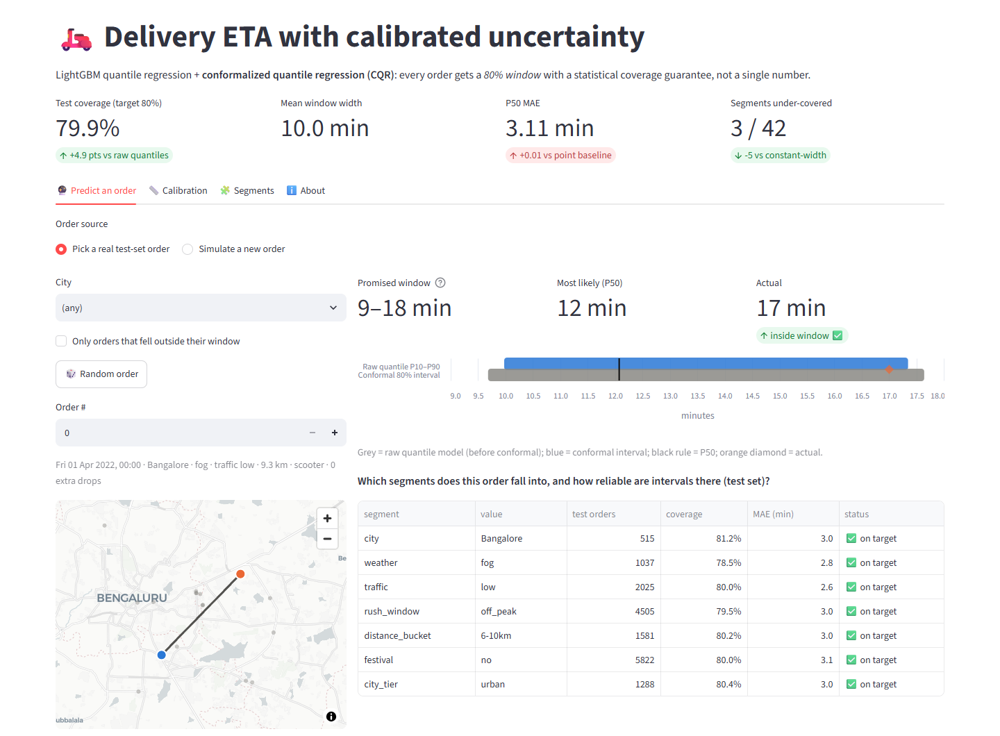
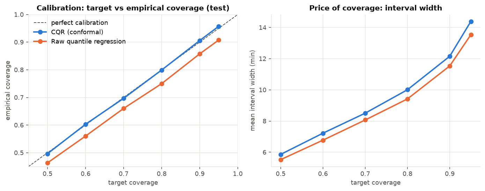
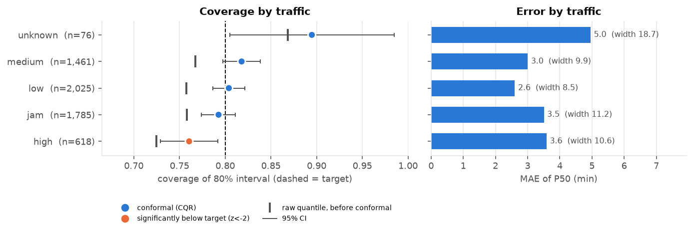
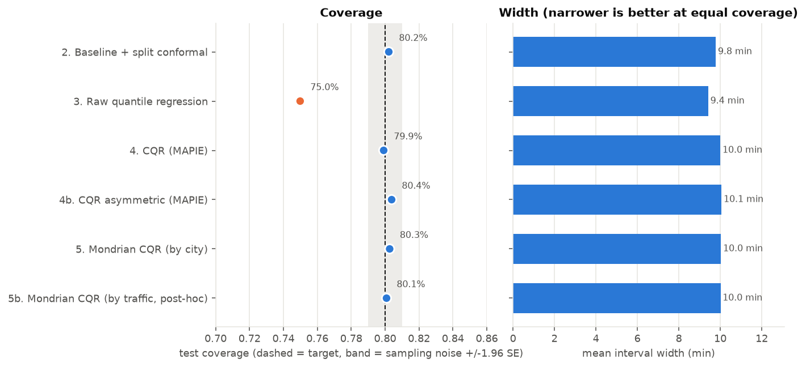
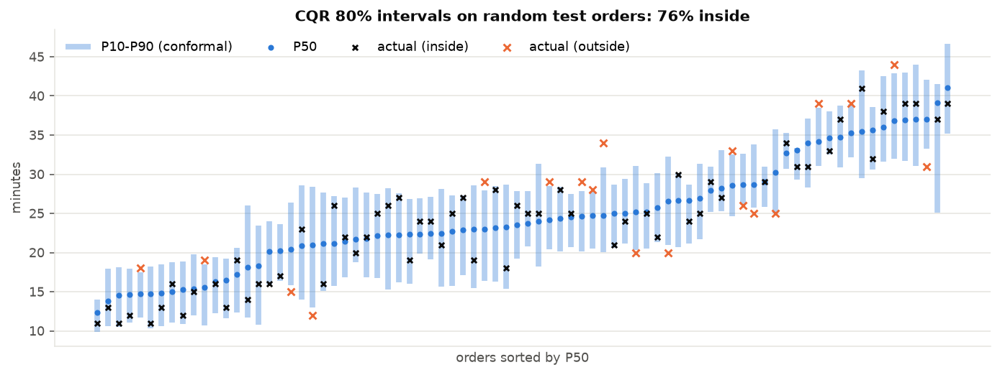

# 🛵 Food Delivery Time Prediction with Confidence Intervals

**Predicts food-delivery time as a window ("15–25 min") with a statistical coverage guarantee, instead of a single number.**
LightGBM quantile regression (P10/P50/P90) + **Conformalized Quantile Regression** (MAPIE) + segment-level reliability analysis,
tracked in MLflow and demoed in Streamlit.

| | Result on the unseen final week (5,965 orders) |
|---|---|
| 🎯 **Coverage** | Raw quantile models promised 80% but delivered **75.0%**. After conformal calibration: **79.9%** (target 80%) |
| 📏 **Sharpness** | Mean window **10.0 min**, vs 25 min for a no-model P10–P90 (**60% narrower** at the same promise) |
| 🧩 **Holds per segment** | A constant-width interval also hits 80% overall but fails **8 / 42 segments** (traffic jams: **72.9%**). CQR: **3 / 42**, all within multiple-testing noise |
| 📐 **Calibrated at every level** | Target 50/60/70/80/90/95% → actual 49.7/60.3/69.7/79.9/90.6/95.7% |
| ⚖️ **Point accuracy kept** | P50 MAE **3.11 min** vs 3.10 for a plain L2 LightGBM baseline: the window comes at no accuracy cost |

> **Honest scope.** The Kaggle data is semi-synthetic (audited in [`notebooks/01_eda.ipynb`](notebooks/01_eda.ipynb)):
> customer locations are generated offsets and weather is uniformly random. The **methodology** is the deliverable;
> the numbers describe this dataset. See [Limitations](#-limitations--what-id-say-in-an-interview).



---

## Why intervals instead of a point ETA?

In quick-commerce and food delivery, the ETA is a **promise**. A point estimate of "22 min" is wrong almost every time,
and it says nothing about *how* wrong it might be. Operations need the spread:

- **Customer promise / SLA**: show the upper bound you can keep 80–90% of the time; late deliveries drive refunds and churn far more than early ones.
- **Dispatch & batching**: a rider can take a second order only if the first order's *P90*, not P50, still fits.
- **Dynamic buffers**: wide intervals flag risky orders (rush-hour jams, festival days) for proactive padding or customer comms.
- **Capacity planning**: kitchens and hubs plan on tails, not averages.

Raw quantile models *look* like they give this, but they're usually **over-confident** (here: 75% coverage for an "80%" interval).
Conformal prediction fixes that with a finite-sample guarantee, using only a held-out calibration set.

---

## Architecture

```
                    Kaggle: gauravmalik26/food-delivery-dataset  (45,593 orders, 22 Indian cities)
                                              │
                         src/data/download.py │ kagglehub (no API token needed for public data)
                                              ▼
 src/data/clean.py      strip "NaN " strings · fix sign-flipped & (0,0) coords · midnight crossover
                        · impute+flag missing order time · city from rider ID · outlier rules   → 41,953 rows
                                              │
 src/data/features.py   haversine km · hour / weekday / rush window (12–14h, 19–21h) · traffic ordinal
                        · weather bucket · KMeans geo-cluster (train-fit) · fixed category vocab
                                              │
            chronological, day-aligned split  ▼
   ┌─────────────── train ───────────────┬─── val ───┬──── calib ────┬──── test ────┐
   │ Feb 11 – Mar 20 · 26,052            │ Mar 21–25 │ Mar 26–31     │ Apr 1–6      │
   │ fit LightGBM                        │ early stop│ conformal     │ reported     │
   │                                     │ + Optuna  │ scores ONLY   │ once         │
   └─────────────────────────────────────┴───────────┴───────────────┴──────────────┘
                                              │
 src/models/train_quantile.py   LightGBM  objective=quantile  α = 0.1 / 0.5 / 0.9   (+ L2 point baseline)
 src/models/conformal.py        MAPIE ConformalizedQuantileRegressor (prefit)  ·  hand-written CQR (tested = MAPIE)
                                ·  Mondrian (per-segment) CQR
 src/models/evaluate.py         pinball · coverage · width · Winkler score · MAE/RMSE · calibration curve
 src/analysis/error_slices.py   coverage / MAE / pinball by city, weather, traffic, rush hour, distance … + z-scores
 src/tracking/mlflow_utils.py   params · data hash · 100+ metrics · figures · slice tables · model files  → mlflow.db
                                              │
 app/streamlit_app.py           pydeck map · pick a test order or simulate one · interval vs actual
                                · segment reliability note · calibration curve · segment explorer
```

`src/pipeline.py` runs the whole model ladder in one MLflow run:

| # | Method | What it shows |
|---|---|---|
| 1 | L2 LightGBM point estimate | the conventional "before" |
| 2 | Baseline + split conformal (\|residual\|) | calibrated, but **constant width** for every order |
| 3 | Raw LightGBM quantiles P10–P90 | adaptive width, but **uncalibrated** |
| 4 | **CQR (MAPIE)** | adaptive **and** calibrated: the "after" |
| 5 | Mondrian CQR | per-segment calibration (segment chosen on val, not test) |

---

## Key results (test week, 80% target)

| Method | Coverage | Mean width (min) | Interval score ↓ | Late vs window | Worst segment | Segments < target (z<−2) | mean z² | MAE (min) |
|---|---|---|---|---|---|---|---|---|
| 1. Point baseline (L2) | – | – | – | – | – | – | – | **3.10** |
| 2. Baseline + split conformal | 80.2% | **9.79** | 13.28 | 10.1% | 72.9% (jam) | 8 / 42 | 8.72 | 3.10 |
| 3. Raw quantile regression | ❌ 75.0% | 9.42 | 12.13 | 12.6% | 71.4% | 37 / 42 | 21.78 | 3.11 |
| **4. CQR (MAPIE)** | **79.9%** | 10.01 | **12.06** | 10.5% | **76.4%** | **3 / 42** | **1.34** | 3.11 |
| 4b. CQR asymmetric | 80.4% | 10.06 | 12.06 | **9.6%** | – | – | – | 3.11 |
| 5. Mondrian CQR (city, val-chosen) | 80.3% | 10.04 | 12.09 | 10.3% | 75.1% | 3 / 42 | 2.02 | 3.11 |

*mean z² ≈ 1 means per-segment coverage gaps are pure sampling noise; ≫ 1 means systematic mis-calibration. Pinball loss (raw models): P10 0.583 · P50 1.554 · P90 0.630. Conformal widened each side by +0.29 min. Optuna (30 trials, val only) cut mean val pinball 0.936 → 0.907.*

**Reading the table honestly**
- CQR's win is **reliability across segments**, not raw width. The constant-width interval is 0.2 min narrower, but it gets its 80%
  by over-covering easy orders and failing the hard ones (traffic jam 72.9%, dinner rush 73.8%, z < −5).
- The weakest CQR segment, **traffic = high (n = 618), drops to 76.4%** (z = −2.3). With 42 segments tested, ~1 such flag is
  expected by chance, and none passes a Bonferroni threshold (|z| > 3.0). Mondrian CQR by traffic did *not* fix it (→ 75.1%),
  which supports the noise reading. It stays a monitored watch item.
- The **real** weak spot is a segment too small for the n ≥ 100 rule: **semi-urban, 54% coverage on 24 orders** (see Limitations).
- A run that also uses prep time (pickup − order, which is leaky at order time) gives identical results (MAE 3.10, coverage 80.1%), so excluding it costs nothing.

| Calibration curve | Coverage by traffic |
|---|---|
|  |  |
|  |  |

---

## Reproduce

> Tested on **Windows 11 + Python 3.11** (via uv). Same commands work on macOS/Linux with `/` paths.

```powershell
# 0. environment (uv downloads Python 3.11 for you; the first sync is large: mlflow + jupyter)
python -m pip install --user uv
python -m uv python install 3.11
python -m uv sync --python 3.11

# 1-6. everything (download → clean → features → tune → train/conformal/slices → tests), ~5 min
.\run_all.ps1            # add -Tune to rerun Optuna, -Fresh to wipe MLflow     (macOS/Linux: ./run_all.sh)
```

Or step by step:

```powershell
$env:MLFLOW_DISABLE_AGENT_HINT = "1"
.venv\Scripts\python -m src.data.download             # data/raw/train.csv  (public: no Kaggle token needed)
.venv\Scripts\python -m src.data.clean                # data/processed/clean.parquet
.venv\Scripts\python -m src.data.features             # features.parquet + feature_artifacts.joblib
.venv\Scripts\python -m src.models.tune --trials 30   # optional → reports/best_params.json
.venv\Scripts\python -m src.pipeline                  # main run → models/, reports/, MLflow
.venv\Scripts\python -m src.pipeline --feature-set pickup --no-save   # leakage comparison run
.venv\Scripts\python -m pytest -q                     # 18 tests

.venv\Scripts\mlflow ui --backend-store-uri sqlite:///mlflow.db --port 5000   # → http://localhost:5000
.venv\Scripts\streamlit run app\streamlit_app.py                               # → http://localhost:8501
```

**pip instead of uv:** `py -3.11 -m venv .venv; .venv\Scripts\pip install -r requirements.txt pytest jupyter ipykernel`

**EDA notebook:** `.venv\Scripts\python -m ipykernel install --user --name eta-prediction`, then open
`notebooks/01_eda.ipynb` with the *Python 3.11 (eta-prediction)* kernel.

### Gotchas I already hit (so you don't)
| Symptom | Cause / fix |
|---|---|
| GeoPandas / GDAL install errors | Not an issue with GeoPandas ≥ 1.0: it ships `pyogrio` + `shapely` wheels, so no system GDAL is needed. Don't `conda`-mix. |
| Wheels missing on Python 3.13/3.14 | Use 3.11 (pinned in `pyproject.toml`); uv installs it side-by-side. |
| `uv` "Failed to acquire lock" | Two uv commands at once share a cache lock. Run one at a time. |
| Notebook `ModuleNotFoundError: numpy` | Kernel is the system Python. Register and select the venv kernel (above). |
| `UnicodeDecodeError: 'charmap'` on Windows | Read files with `encoding="utf-8"` (the app source contains emoji). |
| MLflow prints an "agent hint" banner | Cosmetic. `MLFLOW_DISABLE_AGENT_HINT=1`. |
| `kagglehub` fails | Put `kaggle.json` in `%USERPROFILE%\.kaggle\`, or download the ZIP manually into `data/raw/`. |

---

## Repository

```
eta-prediction/
├── data/{raw,processed}/          # gitignored; rebuilt by the pipeline
├── notebooks/01_eda.ipynb         # EDA + data-authenticity audit
├── src/
│   ├── data/        download.py · clean.py · features.py
│   ├── models/      train_quantile.py · conformal.py · evaluate.py · tune.py
│   ├── analysis/    error_slices.py · plotting.py
│   ├── tracking/    mlflow_utils.py
│   └── pipeline.py  # one command → full model ladder + MLflow run
├── app/streamlit_app.py
├── tests/           test_data.py · test_models.py · test_app.py     (18 tests, CI on push)
├── reports/         metrics_*.json · comparison_*.csv · error_slices.{csv,md} · figures/
├── docs/            model_card.md · interview_prep.md · images/
├── run_all.ps1 · run_all.sh · pyproject.toml · requirements.txt
└── .github/workflows/ci.yml
```

---

## Design decisions worth defending

- **Separate calibration split.** train → fit, val → early stopping + Optuna + choosing the Mondrian segment, calib → conformal scores
  *only*, test → reported once. Residuals from data a model has seen are too small, and coverage silently breaks.
- **Chronological, day-aligned split.** A random split leaks same-day weather, traffic and festival effects into test and makes
  calibration look better than it will be live.
- **Hand-written CQR next to MAPIE.** `tests/test_models.py` asserts they agree. The test also caught that `np.quantile(method="higher")`
  at level k/n isn't exactly the k-th order statistic. The exact definition is pinned.
- **Haversine, not GeoPandas, for distance.** Haversine is more accurate for point-to-point distance (one pan-India projection measured
  −1.7% scale error) and ~55× faster. GeoPandas is still in the repo (`projected_distance_km`) for comparison; it's the right tool for
  zones and spatial joins, not for this.
- **Prep time excluded.** Pickup time isn't known when the order is placed. It's available as a separate `pickup` feature set for re-estimates.
- **One feature path for train and serve.** `featurize()` + saved train-fit artifacts power both the pipeline and the app (unit-tested parity).

## ⚠️ Limitations (what I'd say in an interview)

1. **Semi-synthetic data.** Customer = restaurant + equal lat/lon offset (12 values, 388 restaurants), so geospatial signal is capped and bearing is
   constant. Weather is ~16.5% per class in every city. Prep time ∈ {5, 10, 15}. The target is clipped to 10–54 min, so tail risk is understated.
2. **Possible leakage in `rider_rating`** (top feature, 22% of gain). If ratings were aggregated after deliveries, including this one, it's leaky.
   The dataset doesn't say. Production should use the rating *as of order time*.
3. **Exchangeability is approximate.** The guarantee assumes calib and test are exchangeable. Across weeks it held here (calibration curve on the
   diagonal), but drift such as monsoon, a new city or a promo would break it. **Needed:** rolling recalibration or Adaptive Conformal Inference
   plus a live coverage monitor.
4. **Marginal, not conditional, guarantee, and a real blind spot.** Per-segment coverage is checked, not guaranteed. The clearest failure is
   too small to pass the n ≥ 100 flagging rule: **semi-urban orders cover only 54% (13 of 24 test orders)**. They average ~50 min (2× the
   norm), and the model saw only 84 of them in training. Fix: Mondrian calibration once there's enough data, or a conservative fallback
   (e.g. global P95 bounds) for rare segments. Festival days (n = 110) cover 80% but with a ±7.5-pt CI.
5. **What production needs beyond this:** real-time traffic and rider GPS, restaurant kitchen load / queue, routing-engine road distance, stage-wise
   modelling (prep → wait → travel), and an asymmetric business loss (lateness costs more than earliness).

Detailed Q&A: [`docs/interview_prep.md`](docs/interview_prep.md) · model card: [`docs/model_card.md`](docs/model_card.md)

---

*Data: [gauravmalik26/food-delivery-dataset](https://www.kaggle.com/datasets/gauravmalik26/food-delivery-dataset) (Kaggle).
References: Romano, Patterson & Candès (2019) "Conformalized Quantile Regression"; Vovk et al. (2005) "Algorithmic Learning in a Random World";
Gibbs & Candès (2021) "Adaptive Conformal Inference Under Distribution Shift"; Chernozhukov et al. (2010) "Quantile and Probability Curves Without Crossing".*
